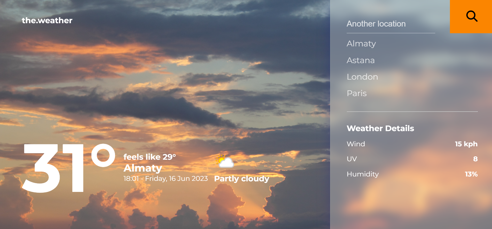
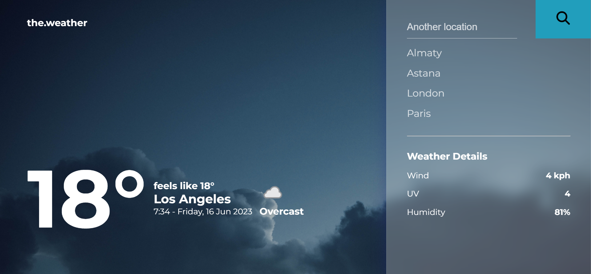
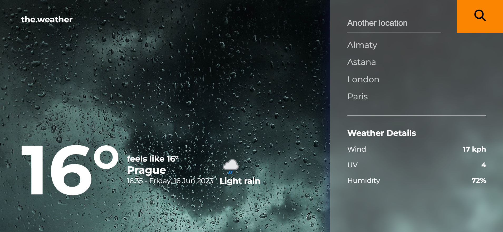

# WEATHER-APP

Design inspiration - https://dribbble.com/shots/7118235-Weather-DailyUI-037 

This app was designed and made for practicing API manipulation. It shows the current weather, wind, humidity and UV level in different cities. A user can input any city and the weather will be displayed accordingly.

There are several pinned cities as well.

Another feature of this app is the changing background. It switches icons and pictures in accordance with the current weather conditions. 

#### !IMPORTANT. It's not adapted for mobile views YET. 

 
